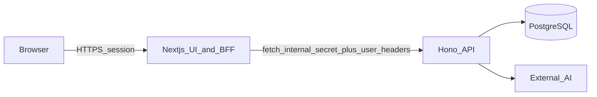

# Project structure (split stack)

Monorepo: **`frontend/`** (Next.js + BFF) and **`backend/`** (Hono + Prisma + AI). Shared database schema lives only under **`backend/prisma/`**.

## Root

| Path | Purpose |
|------|---------|
| [package.json](package.json) | npm workspaces; scripts `dev`, `build`, `db:*` delegate to packages |
| [.env.example](.env.example) | Pointers to split `frontend/.env` and `backend/.env` |
| [scripts/](scripts) | Optional shared scripts (AI verify lives in `backend/scripts`) |
| [test-hash.js](test-hash.js) | Ad-hoc utility |

## `backend/`

| Path | Purpose |
|------|---------|
| [package.json](backend/package.json) | Hono, Prisma, AI/PDF/mail dependencies |
| [tsconfig.json](backend/tsconfig.json) | NodeNext + `@/*` → `src/*` |
| [prisma/schema.prisma](backend/prisma/schema.prisma) | PostgreSQL schema |
| [prisma/seed.ts](backend/prisma/seed.ts) | DB seed |
| [.env.example](backend/.env.example) | `DATABASE_URL`, `INTERNAL_API_SECRET`, `PORT`, AI, optional SMTP |
| [src/server.ts](backend/src/server.ts) | HTTP server entry (`@hono/node-server`) |
| [src/app.ts](backend/src/app.ts) | Hono app + `/health` |
| [src/api/register-all.routes.ts](backend/src/api/register-all.routes.ts) | All `/api/*` handlers (business logic moved from Next) |
| [src/common/](backend/src/common) | Internal auth middleware, HTTP helpers, guards, smoke test |
| [src/lib/](backend/src/lib) | Prisma singleton, permissions, exam/AI runners, providers |
| [src/modules/student-extraction/](backend/src/modules/student-extraction/) | Student OCR handler module |
| [scripts/verify-ai-env.mjs](backend/scripts/verify-ai-env.mjs) | Validates AI env against `backend/.env` |

## `frontend/`

| Path | Purpose |
|------|---------|
| [package.json](frontend/package.json) | Next 14, React, NextAuth, UI libs |
| [next.config.mjs](frontend/next.config.mjs) | Next config (PDF-related externals) |
| [tsconfig.json](frontend/tsconfig.json) | Next TypeScript |
| [tailwind.config.ts](frontend/tailwind.config.ts) | Tailwind |
| [middleware.ts](frontend/src/middleware.ts) | NextAuth + role route guards |
| [src/app/](frontend/src/app) | App Router pages + layouts |
| [src/app/api/auth/](frontend/src/app/api/auth) | NextAuth only (stays in Next) |
| [src/app/api/.../route.ts](frontend/src/app/api) | Thin BFF proxies → backend |
| [src/lib/bff-proxy.ts](frontend/src/lib/bff-proxy.ts) | Session gate + `INTERNAL_API_SECRET` + upstream fetch |
| [src/lib/auth.ts](frontend/src/lib/auth.ts) | NextAuth options (Prisma credentials) |
| [src/lib/auth-server.ts](frontend/src/lib/auth-server.ts) | `getServerSession` helpers for RSC/layouts |
| [src/components/](frontend/src/components) | UI (exams, shared shell, Radix) |
| [src/store/](frontend/src/store) | Zustand exam store |
| [.env.example](frontend/.env.example) | `NEXTAUTH_*`, `INTERNAL_API_URL`, `INTERNAL_API_SECRET`, DB for login |

## Notes

- Support ticket images are written by the backend under **`frontend/public/uploads/...`** by default (`MEDIA_PUBLIC_ROOT` overrides).
- **Modular folders** (`src/modules/*` per feature with controller/service split) are applied on the backend via `register-all.routes.ts` + `modules/student-extraction`; the frontend can be further split into `src/modules/*` incrementally without changing runtime behavior.
